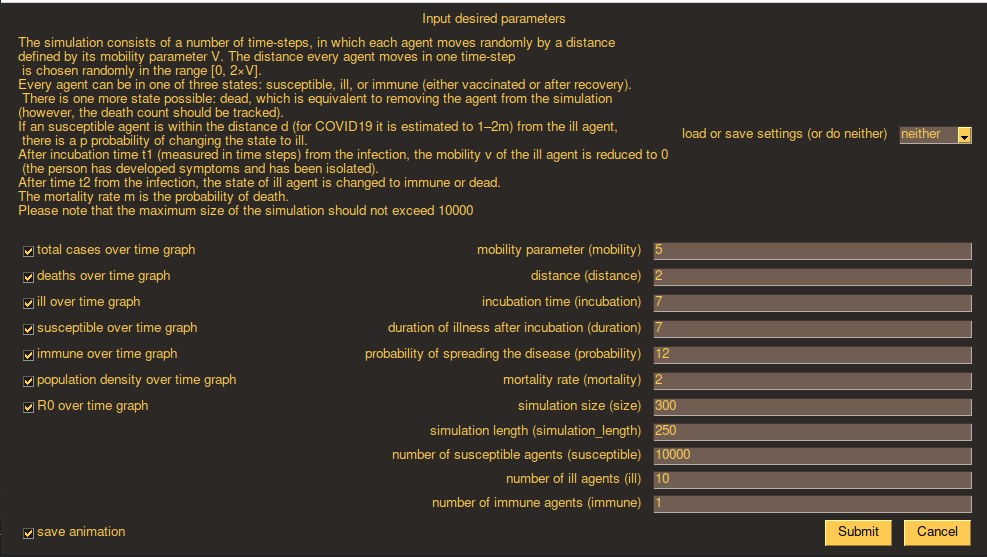
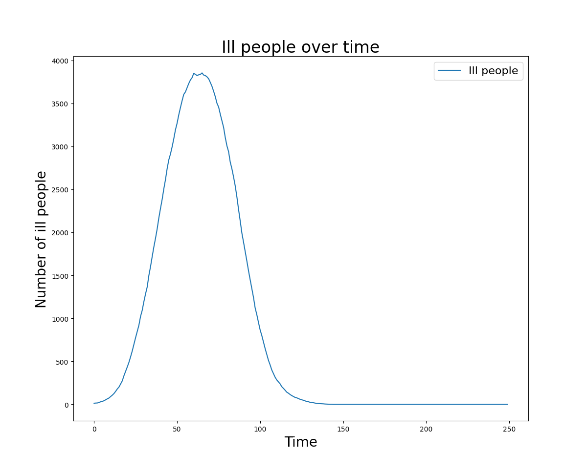

# COVID Simulator

A small, fun project I had to do for university

## Problem Description

Write a agent-based simulator visualizing spread of an infectious disease. An agent is a single point in 2D space, representing a human being. The rules of the simulation are as follows:

1. The simulation should consist of a number of time-steps, in which each agent moves randomly by a distance defined by its mobility parameter *V*. The distance every agent moves in one time-step is chosen randomly in the range [0, 2×*V*].
2. Every agent can be in one of three states: *susceptible*, *ill*, or *immune* (either vaccinated or after recovery). There is one more state possible: *dead*, which is equivalent to removing the agent from the simulation (however, the death count should be tracked).
3. If an *susceptible* agent is within the distance *d* (for COVID19 it is estimated to 1–2 m) from the *ill* agent, there is a *p* probability of changing the state to *ill*.
4. After incubation time *t*1 (measured in time steps) from the infection, the mobility *v* of the *ill* agent is reduced to 0 (the person has developed symptoms and has been isolated).
5. After time *t*2 from the infection, the state of *ill* agent is changed to *immune* or *dead*. The mortality rate *m* is the probability of death.

Your task is to create an animation of the disease spread and plot the number of total cases, active cases and deaths as a function of time. You should investigate the spread of the disease depending on the parameters *V*, *p*, *t*1, *t*2, and *m* and also of the total population number and average population density (average distance between the agents). In each case, estimate the number *R*0, which is an average number of *susceptible* people every *ill* person can infect. Investigate the impact of the social distancing (*V* parameter — mind that it does not need to be equal for every individual) on the spread of the disease.

You can see a similar (although with different assumptions) simulation in a [Washington Post article](https://www.washingtonpost.com/graphics/2020/world/corona-simulator/). You are free to propose any improvements to the model to make it more realistic. Discuss it with the teacher as it can significantly improve your score.

## Program Requirements

Your code must be object-oriented and written in such a way that it can be easily improved and extended. In particular numerical part must be separate from input/output and data visualization. For making plots and animations you **must** use either Matplotlib or Plotly. However, changing the presentation part to something else should be straightforward.

The simulation code should allow to launch simulations, specify parameters and see the results. **In addition** you must present some investigations of the questions raised in the problem description (e.g. the impact of social distancing). Preferable format of such report is a Jupyter Notebook importing your module and running your code.

Your mark will depend on two factors: how well your code fulfills the task (including model improvements) and the elegance and legibility of the code (you may want to read [Python Style Guide](https://www.python.org/dev/peps/pep-0008/) for some hints).

## Simulation Results

